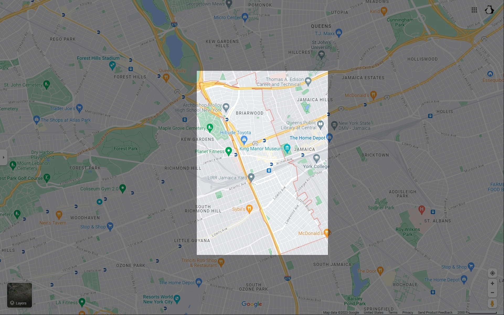
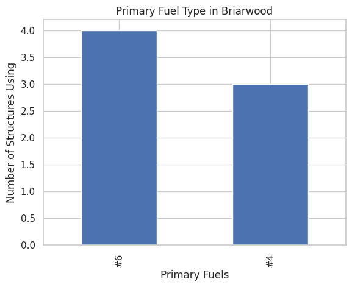
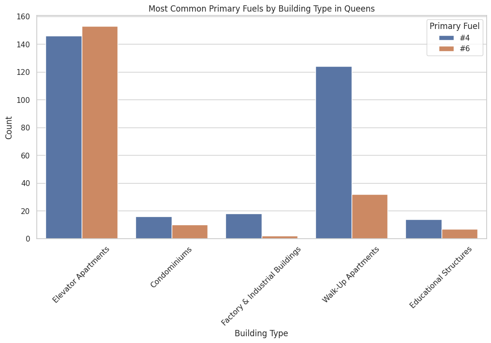

# The Energy of Briarwood
HC 11

  This is the neighborhood of Briarwood.

  Briarwood is a neighborhood situated within the borough of Queens, the neighborhood has a zip code of 11435. This neighborhood is middle class and has good infrastructure for the area. The average population per square mile is about 40,000 to 50,000 people.  In Briarwood the population  consists of Asian-Americans (14.4%), White (26.7%), Hispanics (29.3%), and African Americans (33.3%) with a median age of 35 years. This neighborhood is very diverse housing multiple types of people living here different from the world war two era where it was predominantly white with many Jewish people living in the area. 

  The Clean Heat program has been set in motion recently as an initiative against the wasteful usage of energy, predominantly caused by the buildings of New York City. This tackles mainly boiler usage as these use No.4 and No.6 fuels which pollute the environment in a catastrophic manner. To combat these many plans the Greener Greater Buildings Plan was enacted. This plan seeks to increase the transparency between buildings owners and the public on their energy usage. With this knowledge available to the public people will begin to keep these buildings in line. There are also many programs that seek to help smaller businesses become eco-friendly for free so that everyone helps our environment by keeping our energy clean.

  The emissions caused are mainly caused by buildings in NYC being a grand total of 35% of emissions within New York while transportation follows close behind with 20% of emissions. Transportation is not much of an issue because electric vehicles are commonplace and many NYC residents use public transportation. What is difficult to combat though is buildings. Many buildings in the city are historical artifacts and tearing these down can allow us to lose history ingrained within the buildings. Due to the difficulty the NYC Clean Heat program was enacted and Eric Adams has limited meat consumption because it also creates unnecessary waste for our environment.

  In Briarwood, the primary fuel used is No.6 fuels. This may make sense as Briarwood is a lower income area compared to Astoria. Therefore, many building owners and businesses may not be able to properly follow regulations simply because No. 4 fuels may not be affordable for everyone. This also because many buildings here are mostly elevator apartments.

  In Queens overall, elevator apartments seem to waste the most amount of energy out of any other building. This may come as a surprise, however, elevators use lots of energy. Think of the times you have used an elevator then multiply that by all the people that also go into the building. That would be a very large amount of people using the elevator. To combat this we must either find a clean energy source for the elevators or we must alternatives.

<dl>
  <iframe src="NYC_boiler_Locations" width="600" height="400" frameborder="0" frameborder="0" marginwidth="0" marginheight="0" allowfullscreen></iframe>
</dl>

There are 5 noticable boilers within the boundaries of the Briarwood neighborhood.
This might not seem as much, however, the environmental impact is costly. These burn millions of gallons relasing many pollutants. We must find a way to solve to keep our planet clean.

